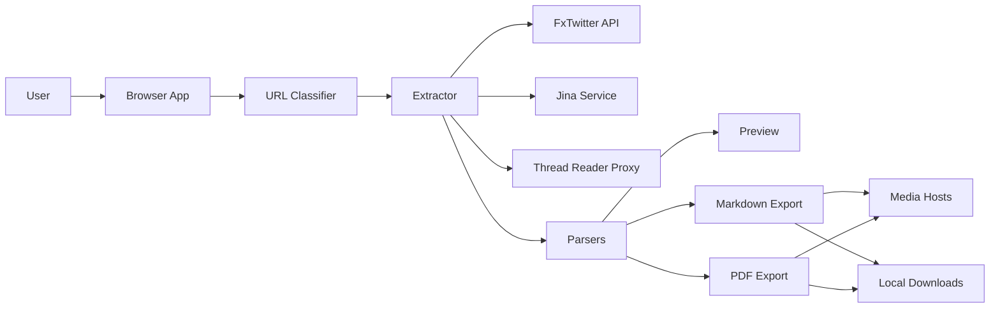

## Executive summary
The top risks are privacy leakage and untrusted-content handling in a fully client-side, public web app that sends user-provided URLs to third-party extractors and fetches remote media for export. The highest-risk areas are the extraction fallback chain (`fxtwitter` -> `jina`/ThreadReader proxy paths), untrusted content-to-export transformation, and unbounded media fetching during PDF/ZIP generation, which together create exposure to sensitive URL disclosure, integrity poisoning, and client-side availability degradation.

## Scope and assumptions
- In-scope paths:
  - `src/**` (runtime web app, parsers, extractors, PDF/Markdown exports)
  - `public/**` (deployment metadata/docs)
  - `README.md`
- Out-of-scope:
  - Companion extension runtime trust model and deployment hardening (`extension/**`) per user instruction: extension is not production-critical.
  - CI/test-only logic (`tests/**`, `playwright.config.ts`, `vitest` config) except where referenced for context.
- Explicit assumptions:
  - App is publicly internet-facing for general users.
  - No backend API owned by this repo; execution is browser-side only (`README.md`, `public/llm.txt`).
  - Users may paste URLs containing sensitive query params/tokens.
  - Input URL validation only constrains host/path to X/Twitter patterns before extraction (`src/lib/xUrl.ts`, `src/lib/extractArticle.ts`).
  - No account/auth model exists in this app (no auth code paths present in `src/**`).

Open questions that would materially change ranking:
- Whether production hosting sets strict CSP/Trusted Types and outbound `connect-src` restrictions (not represented in this repo).
- Whether legal/compliance policy treats pasted URL tokens and extracted content as regulated sensitive data.

## System model
### Primary components
- React SPA UI and orchestration (`src/App.tsx`): collects URL, loads article, triggers preview/export.
- URL classifier/normalizer (`src/lib/xUrl.ts`): domain/path checks for X/Twitter status/article links.
- Extraction orchestrator (`src/lib/extractArticle.ts`): fallback chain across third-party providers.
- Content parsers (`src/lib/articleParser.ts`, `src/lib/fxTweetParser.ts`): convert external JSON/HTML/Markdown into internal `ExtractedArticle` blocks.
- Exporters:
  - Markdown/ZIP (`src/lib/markdownExport.ts`) with optional remote media bundling.
  - PDF (`src/lib/pdfExport.ts`) with remote media fetch and embedded document generation.
- Browser download sink: `Blob` + anchor download for generated files (`src/lib/markdownExport.ts`, `src/lib/pdfExport.ts`).

### Data flows and trust boundaries
- User Browser Input -> URL Classifier/Extractor
  - Data crossing: user-pasted URL and optional query string from `window.location.search`.
  - Channel: browser DOM/events.
  - Security guarantees: local execution only; HTTPS depends on hosting.
  - Validation: X/Twitter domain + status/article path checks (`src/lib/xUrl.ts:20-63`, `src/App.tsx:123-129`, `src/App.tsx:346-358`).
- Extractor -> External provider APIs (`api.fxtwitter.com`, `r.jina.ai`, `api.allorigins.win` + `threadreaderapp.com`)
  - Data crossing: normalized source URL/status ID, request metadata, returned JSON/HTML/Markdown.
  - Channel: browser `fetch` over HTTPS.
  - Security guarantees: TLS in transit only; no provider authenticity pinning or signed payload checks.
  - Validation: HTTP status checks and minimal structural parsing; no cryptographic integrity (`src/lib/extractArticle.ts:24-59`, `src/lib/extractArticle.ts:168-183`, `src/lib/extractArticle.ts:320-403`).
- External provider content -> Parser/Renderer
  - Data crossing: untrusted HTML/Markdown/text/media URLs and metrics.
  - Channel: in-memory parse via `DOMParser` / regex / text transformations.
  - Security guarantees: mostly text extraction (`textContent`); no raw HTML injection into React DOM observed.
  - Validation: best-effort parsing, block count threshold for Jina fallback (`src/lib/articleParser.ts:339-531`, `src/lib/extractArticle.ts:381-383`).
- Parsed content -> Preview + Export pipelines
  - Data crossing: untrusted block text, links, media URLs into React preview, Markdown, and PDF.
  - Channel: React rendering + library transformations.
  - Security guarantees: React escaping for text nodes; external links opened with `rel="noreferrer"` in preview.
  - Validation: none for destination URL allowlist beyond earlier source URL checks (`src/components/ArticlePreview.tsx`, `src/lib/markdownExport.ts:74-110`, `src/lib/pdfExport.ts:201-299`).
- Export pipelines -> Remote media hosts
  - Data crossing: parser-derived media URLs fetched for ZIP/PDF.
  - Channel: browser `fetch`.
  - Security guarantees: browser same-origin/CORS model, but outbound GET still occurs.
  - Validation: content-type/extension heuristics only; no host allowlist/size cap (`src/lib/markdownExport.ts:183-199`, `src/lib/pdfExport.ts:72-83`, `src/lib/pdfExport.ts:266-288`).
- Export pipelines -> Local download target
  - Data crossing: generated Markdown/ZIP/PDF blobs.
  - Channel: browser download APIs.
  - Security guarantees: browser-managed file save dialog/location.
  - Validation: filename sanitization for title/handle segments (`src/lib/markdownExport.ts:4-10`, `src/lib/pdfExport.ts:30-62`).

#### Diagram

## Assets and security objectives
| Asset | Why it matters | Security objective (C/I/A) |
|---|---|---|
| User-pasted URLs (including possible tokens/query params) | May contain sensitive identifiers/session links; sent to third parties | C |
| Extracted article content and metadata | Core product output; poisoning harms user decisions and downstream LLM use | I |
| Client browser resources (CPU/memory/network) | Unbounded parsing/fetching can freeze tab or degrade user device/network | A |
| Generated export files (PDF/Markdown/ZIP) | Used downstream by humans/LLMs; can carry malicious links/prompts | I |
| User local network request surface | Media fetches can trigger outbound requests to attacker-chosen endpoints | C/A |
| App reputation/trust | Public consumer tool; repeated incorrect or malicious exports damage trust | I |

## Attacker model
### Capabilities
- Can submit or influence publicly accessible X/Twitter content that extraction providers return.
- Can lure users to paste crafted X/Twitter URLs (including links with sensitive query parameters).
- Can host remote media/links referenced by extracted content.
- Can exploit lack of host allowlists/size limits in media fetch/export paths.

### Non-capabilities
- Cannot execute server-side code in this repo because there is no backend runtime in scope.
- Cannot directly bypass browser sandbox/CORS to read arbitrary local files.
- Cannot assume companion extension trust violations in production scope (extension marked non-critical/out-of-scope).

## Entry points and attack surfaces
| Surface | How reached | Trust boundary | Notes | Evidence (repo path / symbol) |
|---|---|---|---|---|
| URL input field | User paste/type then `Load Article` | User -> App runtime | Primary untrusted input; then forwarded to providers | `src/App.tsx:490-519`, `src/lib/extractArticle.ts:307-358` |
| `?url=` query param prefill | Visiting app with URL param | Browser location -> App runtime | Silent prefill can influence first load behavior | `src/App.tsx:123-129` |
| Third-party extraction responses | `fetch` to fallback providers | Internet services -> Parser | Untrusted JSON/HTML/Markdown from external services | `src/lib/extractArticle.ts:24-59`, `src/lib/extractArticle.ts:168-183`, `src/lib/articleParser.ts:339-531` |
| Markdown parser image/link handling | Jina markdown lines converted to blocks | Untrusted markdown -> Internal model | Can propagate arbitrary media/embed URLs downstream | `src/lib/articleParser.ts:314-325`, `src/lib/markdownExport.ts:99-107` |
| Preview external links/media | Rendered `img`/`a` from parsed blocks | App -> External URL | User interaction with attacker-influenced links | `src/components/ArticlePreview.tsx` |
| Offline ZIP media bundling | `downloadArticleMarkdownWithMode` fetches each media URL | Parsed content -> External media host | Outbound GET to untrusted hosts; no allowlist/size limit | `src/lib/markdownExport.ts:172-211` |
| PDF media embedding | `loadImageDataUrl` + `blockToContent` | Parsed content -> External media host | Outbound GET + in-memory conversion can be expensive | `src/lib/pdfExport.ts:72-83`, `src/lib/pdfExport.ts:266-288` |
| Clipboard read | User clicks paste icon | Browser permission boundary | Not major risk, but sensitive data may be pasted unintentionally | `src/App.tsx:413-433` |

## Top abuse paths
1. Sensitive URL disclosure to external extractors
   1. Attacker induces user to paste a URL containing access tokens in query params.
   2. App normalizes and forwards URL to third-party extractors.
   3. Third-party services log/store full URL.
   4. Impact: token/privacy leakage outside user control.
2. Third-party content integrity poisoning
   1. Provider returns manipulated article body/metrics.
   2. Parser accepts and formats content as trusted-looking export.
   3. User shares/acts on poisoned PDF/Markdown.
   4. Impact: integrity/reputation damage.
3. Export-time client resource exhaustion
   1. Malicious content references many/huge media assets.
   2. ZIP/PDF pipelines fetch and process assets without strict caps.
   3. Browser tab memory/CPU spikes, potential crash.
   4. Impact: availability loss.
4. Blind internal network request triggering
   1. Attacker-controlled media URLs point to internal/IP-literal endpoints.
   2. User triggers export, browser performs outbound GETs.
   3. Requests hit local/internal services (even if responses unreadable due to CORS).
   4. Impact: privacy/network side effects, possible device-specific abuse.
5. Downstream LLM prompt/markdown injection
   1. Extracted content includes adversarial instructions/links.
   2. App exports Markdown verbatim for LLM workflows.
   3. User or automation feeds markdown into LLM agent.
   4. Impact: downstream task manipulation/data exfil in external systems.
6. Social-engineering via exported links
   1. Malicious embed URLs become clickable in preview/export.
   2. User trusts exported artifact and clicks link.
   3. Phishing/malware distribution occurs outside app domain.
   4. Impact: user compromise beyond app boundary.

## Threat model table
| Threat ID | Threat source | Prerequisites | Threat action | Impact | Impacted assets | Existing controls (evidence) | Gaps | Recommended mitigations | Detection ideas | Likelihood | Impact severity | Priority |
|---|---|---|---|---|---|---|---|---|---|---|---|---|
| TM-001 | Malicious actor / normal user error | User pastes URL containing secrets or sensitive query data | App forwards full URL to third-party extractors (`fxtwitter`/`jina`/proxy paths) | External disclosure of sensitive URLs/tokens | User-pasted URLs, user privacy | Domain/path validation for supported X URLs (`src/lib/xUrl.ts:58-63`); HTTPS fetch | No redaction/minimization before third-party calls; no user warning at submit time | Strip query/fragment before external requests unless explicitly required; add pre-submit warning when query params detected; add “safe mode” toggle forcing status-ID extraction path only | Client telemetry counter for “query params removed”; explicit UI warning impressions/acceptances | high | high | high |
| TM-002 | Attacker controlling extracted content/media URLs | Attacker can influence returned markdown/html content | Induce export pipeline to fetch attacker-chosen media endpoints | Blind requests to internal/local network, privacy leakage, side effects | User local network surface, browser network privacy | URL parsing and extension/content-type heuristics (`src/lib/markdownExport.ts:24-61`) | No media host allowlist, no IP-range blocking, no scheme restrictions beyond URL parse success | Enforce allowed schemes (`https` only), block RFC1918/localhost/IP-literal targets, optionally restrict media hosts to X/Twimg domains by default with override | Log blocked media-host attempts locally and show count in UI notice | medium | high | high |
| TM-003 | Attacker controlling content size/volume | User triggers PDF/ZIP export on crafted article | Force many/large media fetches and PDF image conversions | Browser tab freeze/crash, degraded UX | Client availability, app trust | Some failure handling and continue-on-error (`src/lib/markdownExport.ts:183-199`, `src/lib/pdfExport.ts:72-83`) | No explicit limits on media count, byte size, timeout budget, or concurrent fetches | Add hard caps (count, per-file bytes, total bytes), concurrency limits, and abort budget; add preflight “estimated size” guard with user confirmation | Capture abort/timeout metrics; show “export blocked due to size policy” events | high | medium | high |
| TM-004 | Compromised/unreliable third-party extractor response | Third-party provider returns altered content/metrics | Parser trusts provider output and generates authoritative-looking exports | Integrity poisoning and misinformation | Export content integrity, app reputation | Fallback chain and warnings exist (`src/lib/extractArticle.ts:310-403`); some warnings stored in article | No provenance scoring/signature verification/cross-source consistency checks | Add provenance banner in exports (provider + confidence), cross-check key fields across providers when possible, and flag high divergence | Log provider disagreement rates and expose in diagnostics panel | medium | medium | medium |
| TM-005 | Prompt attacker via public content | User exports markdown and feeds into LLM tooling | Embed adversarial instructions/links in markdown that influence downstream LLM agents | Downstream automation misuse or data exfil in external workflows | Markdown exports, downstream systems | Markdown is plain text; no active script execution in app (`src/lib/markdownExport.ts`) | No content safety annotation/sanitization for LLM-targeted output | Add optional “LLM-safe export” mode: prepend warning header, escape risky link schemes, tag untrusted sections, optionally remove embeds | Count risky patterns (prompt-injection markers, suspicious links) and show warning before download | medium | medium | medium |
| TM-006 | Phishing actor via embedded URLs | User interacts with preview/exported links | Replace embed URLs with deceptive destinations | User credential theft/malware from clicked links | User safety, app trust | Preview uses `target="_blank" rel="noreferrer"` (`src/components/ArticlePreview.tsx`) | No destination reputation checks or visual trust indicators | Display hostname badges for all external links, warn on non-`https` or punycode domains, optional link-disable mode in exports | Track user click-through to flagged links (local-only metric) | medium | medium | medium |
| TM-007 | Supply-chain attacker (npm deps) | Malicious/compromised dependency release lands in build | Runtime executes compromised library code in user browser | Broad client compromise and data exposure | All client-side assets and user data in session | Standard npm lockfile present (`package-lock.json`) | No documented dependency pin/audit/release attestation process in repo | Pin critical deps, run automated `npm audit`/SCA in CI, enable provenance/lockfile integrity checks in release pipeline | Alert on new high/critical advisories for `pdfmake`, `jszip`, React toolchain | low | high | medium |

## Criticality calibration
- Critical for this repo/context:
  - Widespread client-side code execution in all users’ browsers via app/runtime path.
  - Systematic leakage of sensitive pasted tokens to third parties without user awareness and no mitigation path.
  - A trusted export path that can be weaponized for high-confidence credential theft at scale.
- High for this repo/context:
  - Frequent privacy leakage of user-provided URLs/query data to extractor services.
  - Reliable export-triggered browser DoS through unbounded media processing.
  - Internal-network request triggering from attacker-controlled media URLs during export.
- Medium for this repo/context:
  - Integrity poisoning where provider mismatch alters content/metrics but lacks direct code execution.
  - LLM prompt-injection payloads in Markdown that require downstream unsafe automation.
  - Phishing links in exported/previewed content requiring user click.
- Low for this repo/context:
  - Minor metadata inaccuracies (like counts, timestamps) with no security consequence.
  - Non-sensitive info exposure already visible on public X pages.
  - Low-probability dependency issues with no known exploit path in current pinned set.

## Focus paths for security review
| Path | Why it matters | Related Threat IDs |
|---|---|---|
| `src/lib/extractArticle.ts` | Central trust boundary crossing to third-party extractors and fallback orchestration | TM-001, TM-004 |
| `src/lib/xUrl.ts` | Input normalization/allowlist behavior determines what leaves browser | TM-001 |
| `src/lib/articleParser.ts` | Parses untrusted HTML/Markdown and propagates links/media into model | TM-002, TM-004, TM-005 |
| `src/lib/fxTweetParser.ts` | Converts external JSON to internal blocks/metadata used in exports | TM-004 |
| `src/lib/markdownExport.ts` | Performs outbound media fetches and writes LLM-facing artifacts | TM-002, TM-003, TM-005 |
| `src/lib/pdfExport.ts` | Fetches/embeds remote media with potential memory pressure | TM-002, TM-003 |
| `src/components/ArticlePreview.tsx` | User-visible link/media rendering and click behavior | TM-006 |
| `src/App.tsx` | User input collection, query-param ingestion, and export initiation flow | TM-001, TM-003 |
| `README.md` | Declared privacy and architecture claims affecting security assumptions | TM-001, TM-004 |
| `public/llm.txt` | Public-facing operational statements that set user trust expectations | TM-001, TM-005 |

## Quality check
- All discovered runtime entry points were covered: URL input, query prefill, provider responses, media fetch/export, preview links.
- Each trust boundary is represented in at least one threat.
- Runtime behavior is separated from CI/dev/test tooling (not security-critical in this model).
- User clarifications were applied: public-for-everyone deployment, extension non-critical/out-of-scope, sensitive URL paste assumed.
- Remaining assumptions/open questions are explicit in the scope section.
